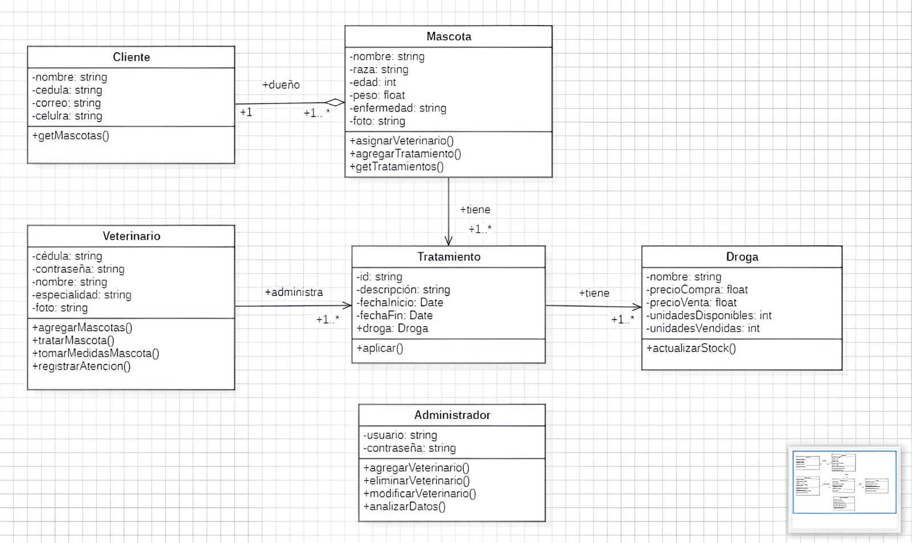
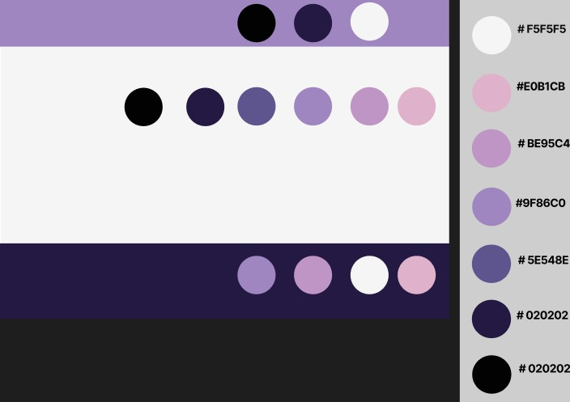

# Veterinary-clinic-JC-web-site

# Jhon the Cat 

Este proyecto es una página web moderna, elegante y responsiva diseñada para una veterinaria llamada "Jhon the Cat" sobre servicios veterinarios, que incluye una navegación fija e intuitiva, un encabezado, contenido principal, una sección de servicios, infromación sobre la compañía y un pie de página con enlaces a redes sociales. La página está diseñada con HTML y CSS.

## Características

- **Diseño Moderno, estilizado y Responsivo**: Se adapta a dispositivos móviles, tablets y escritorios.
- **Navegación Fija**: Un contenedor superior fijo que incluye el logo, la navegación y un botón de inicio de sesión.
- **Animaciones Suaves**: Efectos de transición para una experiencia de usuario agradable.
- **Accordeón Informativo**: Secciones expandibles que muestran más detalles al hacer clic.
- **Sección de Servicios**: Información detallada sobre los servicios ofrecidos, presentada de manera atractiva.
- **Sección de Información**: Detalles sobre la compañía, sus valores y misión.
- **Enlaces a Redes Sociales**: Fácil acceso a nuestras redes para más interacción.
- **Estilos Personalizados**: Incluye una barra de desplazamiento estilizada y una variedad de tipografías atractivas.

## Diagrama UML

## Paleta de colores

  
## Estructura del Proyecto

- `index.html`: Página principal del sitio
- `css/styles.css`: Estilos personalizados
- `js/script.js`: Funcionalidades interactivas
- `images/`: Directorio con imágenes del sitio

## Tecnologías Utilizadas

- **HTML5**: Para la estructura y el contenido de la página.
- **CSS3**: Para el diseño y la presentación visual.
- **JavaScript**
- **Bootstrap 5.3.3**
- **Font Awesome**: Para iconos.
- **Google Fonts**: ABeeZee, Turret Road, Karla.

## Detalles de Diseño

- Paleta de colores: Tonos de púrpura (#5E548E, #9F86C0, #231942) con fondo claro (#F5F5F5)
- Fuentes: Combinación de fuentes sans-serif para legibilidad y estilo
- Diseño de cabecera con imagen de fondo y efecto de superposición
- Menú de navegación fijo con efecto de desaparición al hacer scroll
- Secciones con bordes redondeados y sombras suaves
- Acordeón personalizado para presentar servicios
- Footer con diseño de tres columnas y enlaces de redes sociales

## Características CSS

- Uso de flexbox para layouts responsivos
- Animaciones y transiciones para mejorar la experiencia del usuario
- Media queries para adaptabilidad a diferentes tamaños de pantalla
- Personalización de la barra de desplazamiento
- Efectos de hover en botones y enlaces

## Características JavaScript

El archivo `script.js` incluye funcionalidades para:
- Ocultar/mostrar el menú de navegación al hacer scroll
- Mostrar el menú al mover el ratón hacia la parte superior de la página

## Agradecimientos

- Un agradecimiento especial a todos los colaboradores y a la comunidad por su apoyo y contribuciones.

- ¡Esperamos que disfrutes la página web tanto como nosotros disfrutamos desarrollándolo! No dudes en aportar tus ideas y mejoras.
